# 🏏 **BookMyField - Turf Booking System**  

**BookMyField** is a web-based **turf booking system** that allows customers to book sports fields, field owners to manage their turfs, and admins to oversee the system. It features **user authentication, real-time availability checks, and Razorpay payment integration.**  

---

## 🚀 **Features**  

### ✅ **Customer Functionalities**  
- Browse and search for sports fields.  
- Check **real-time availability** before booking.  
- Select a **date, time slot**, and **duration** for booking.  
- Pay securely using **Razorpay (Google Pay, PhonePe, etc.)**.  
- View **booking history** and status.  

### ✅ **Field Owner Functionalities**  
- Add, update, and manage turfs.  
- View customer bookings for their fields.  
- Approve or reject bookings.  

### ✅ **Admin Functionalities**  
- Approve or reject newly added turfs.  
- View and manage users & field owners.  
- View complaints and messages from users.  

### ✅ **Payment Integration**  
- Razorpay for **seamless payments**.  
- Payment verification to ensure **secure transactions**.  

---

## 🛠️ **Tech Stack**  

| Technology     | Description                         |
|--------------|---------------------------------|
| **Frontend**   | React.js (Vite), Tailwind CSS  |
| **Backend**    | ASP.NET Core Web API, Spring Boot |
| **Database**   | MySQL (via Entity Framework Core) |
| **Authentication** | JWT-based authentication |
| **Payment Gateway** | Razorpay integration |

---

## 📸 **Screenshots**  

### 🏠 Homepage  
  

### 📊 Admin Dashboard  
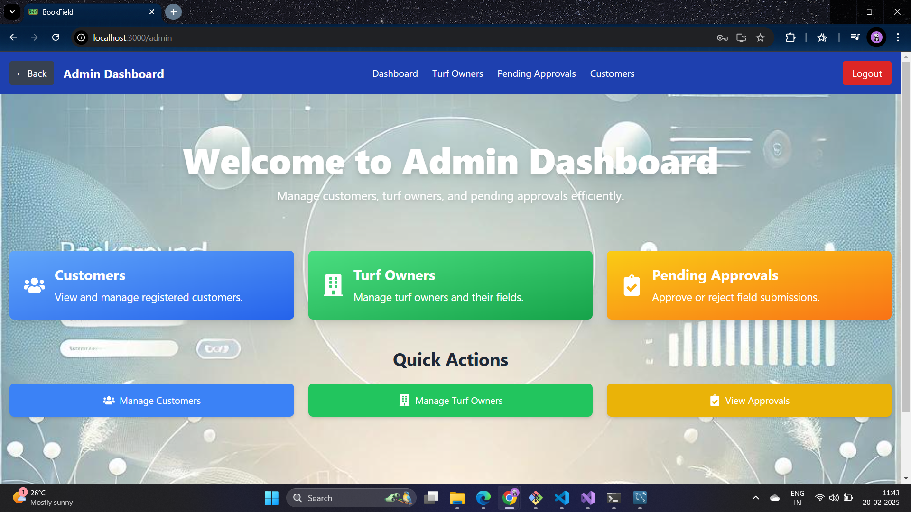  

### 📋 Admin - Registered Customers  
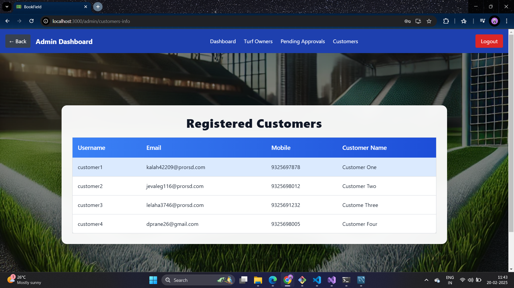  

### ✅ Admin - Pending Approvals  
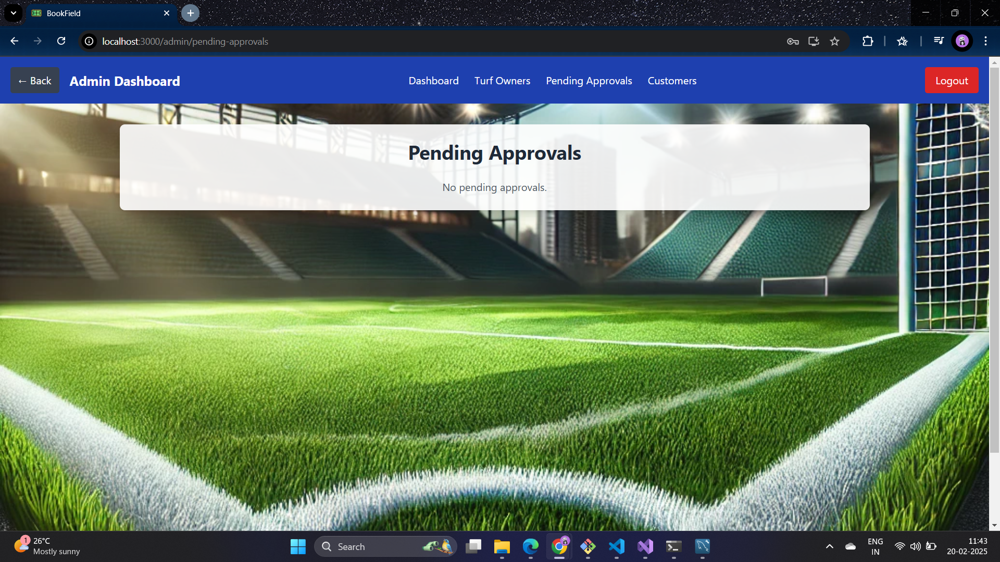  

### 🏟️ Admin - Turf Owners Info  
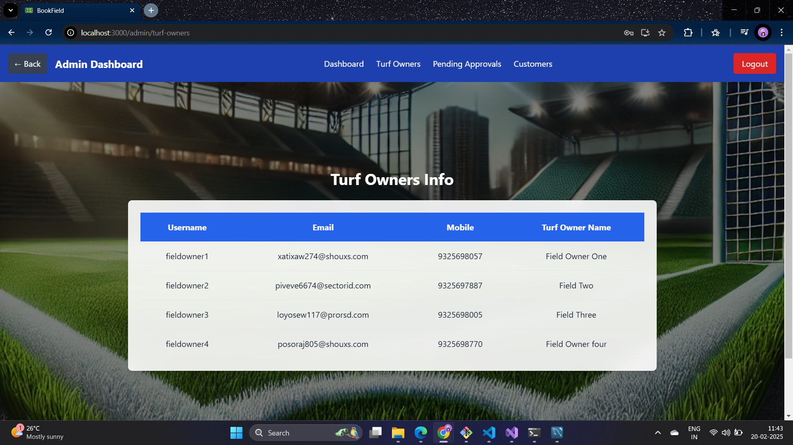  

### ⚽ Field Owner Dashboard  
  

### 🏆 Field Owner - Add Fields  
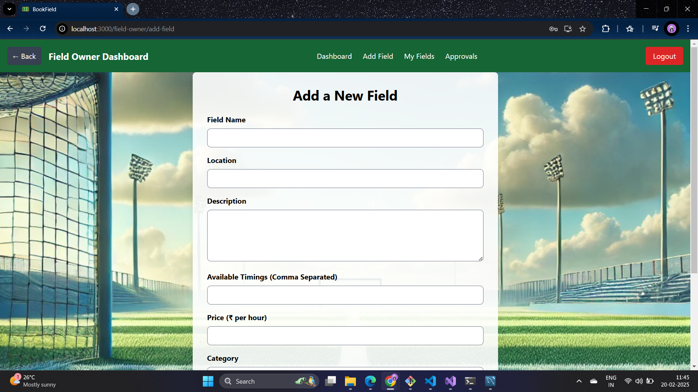  

### 📜 Field Owner - My Fields  
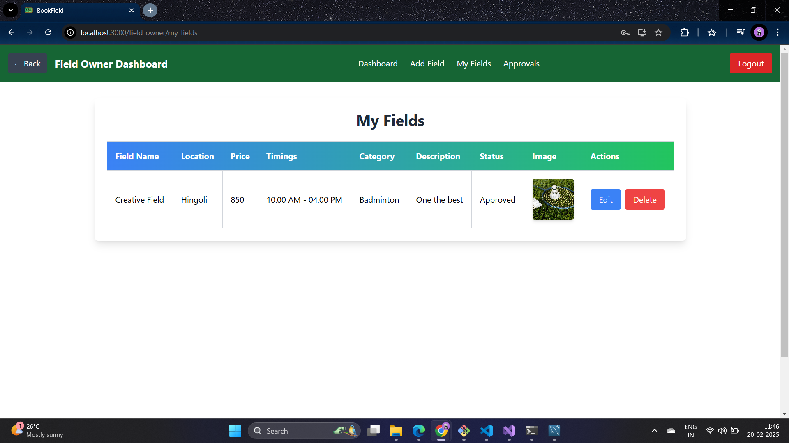  

### 🔎 Field Owner - Approvals  
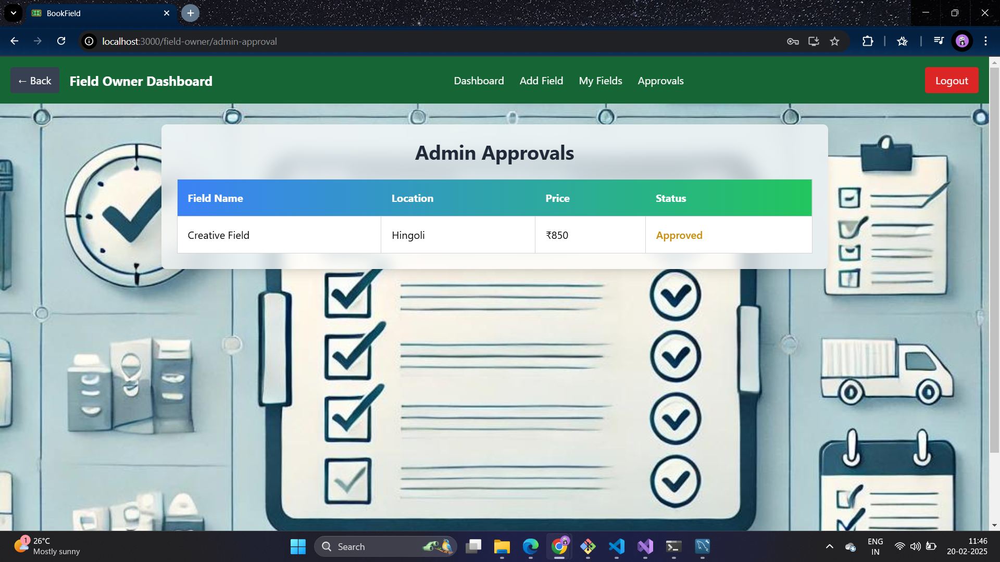  

### 🏁 Customer Dashboard  
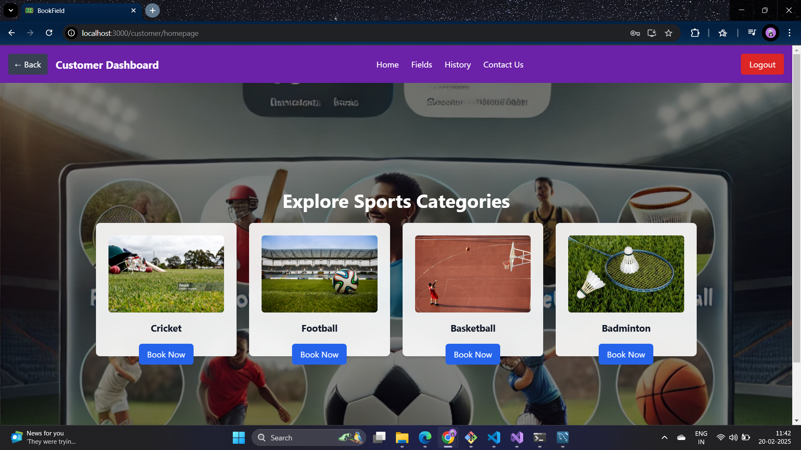  

### 📍 Customer - Available Fields  
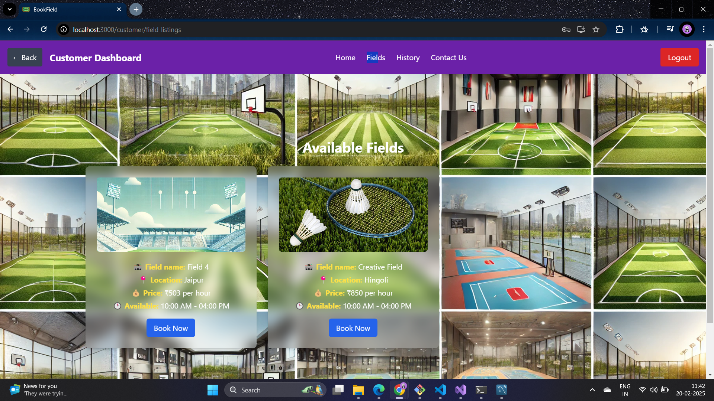  

### 📖 Customer - Booking History  
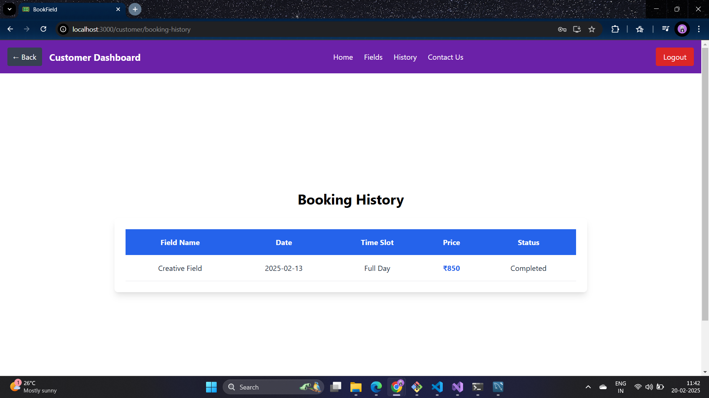  

### 📩 Customer - Contact Us  
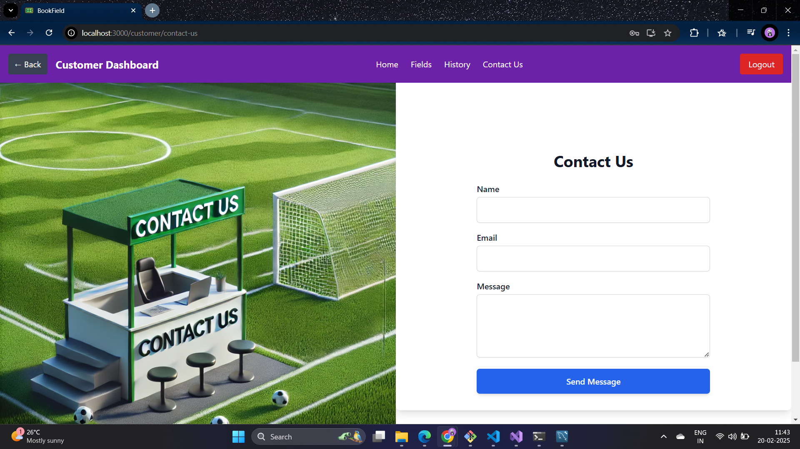  

---

